# How Frequent Indonesians Talk About Climate?

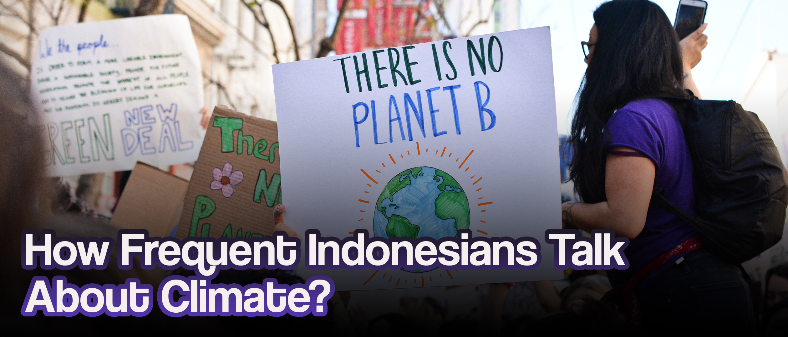

*Illustration asset by [Li-An Lim](https://unsplash.com/@li_anlim?utm_source=unsplash&utm_medium=referral&utm_content=creditCopyText) on [Unsplash](https://unsplash.com/photos/ycW4YxhrWHM?utm_source=unsplash&utm_medium=referral&utm_content=creditCopyText)*

## Table of Content

  * [Table of Content](#table-of-content)
  * [Climate change is real](#climate-change-is-real)
  * [Indonesian netizens tweet’s exploration](#indonesian-netizens-tweets-exploration)
    + [Twitter data preprocessing](#twitter-data-preprocessing)
    + [N-grams analysis](#n-grams-analysis)
      - [Top unigrams](#top-unigrams)
      - [Top bigrams](#top-bigrams)
    + [Text length and word count analysis](#text-length-and-word-count-analysis)
      - [Tweet length](#tweet-length)
      - [Tweet word count](#tweet-word-count)
    + [Word cloud](#word-cloud)
  * [News media content analysis](#news-media-content-analysis)
    + [Word and document analysis: TF-IDF](#word-and-document-analysis-tf-idf)
    + [Sentiment analysis](#sentiment-analysis)
  * [Busting the myth: rising temperatures vs increasing climate-related topics queries](#busting-the-myth-rising-temperatures-vs-increasing-climate-related-topics-queries)
    + [Trend comparison](#trend-comparison)
    + [Correlation statistics](#correlation-statistics)
  * [Closing Thoughts](#closing-thoughts)
  * [References](#references)

---

Nowadays, the internet and social media have become integral parts of people's lives, providing instant access to information and facilitating global communication. While technological advancements have accelerated the spread of information, does the climate change issue is concerning for most of us?

## Climate change is real

Climate change is an indisputable reality supported by overwhelming scientific evidence. The increasing greenhouse gases concentration, rising global temperatures, heatwaves, droughts, and intense storms, all highlight the impact of this issue. Raising awareness and developing a collective sense of urgency among people is vital to drive meaningful action and effectively addressing this global challenge. Recent narratives also prefer to use the ***“climate crisis”*** term in order to raise awareness of how severe the condition could be.

According to studies, when questioned about connecting with climate change information online, Generation Z is more likely to express concern about the future. Nearly seven in ten Gen Z-ers (69%) say they felt apprehensive about the future the most recent time they viewed information about tackling climate change on social media. A smaller majority (59%) of Millennial social media users report feeling this way the last time they encountered climate change information, compared to less than half of Gen X (46%) and Baby Boomers and older (41%) [1].

Studies found out that it only takes 3.5% of the population actively participating in the campaign to ensure its success [2] and created a revolution/movement in a certain country. While it seems naive to expect 3.5%—the magic number—of people around the world to act in behave of climate issues, in fact, how aware public, and specifically Indonesian citizens towards this issue? Have we even reached (or approaching towards) 3.5% of the population to talk about climate crisis issues?

## Indonesian netizens tweet’s exploration

DataReportal [3], shows that there were around 167 million Indonesian social media users, also popularly called as Indonesian netizens, it is more than half of Indonesia’s total population! Among those vast options of social media used by Indonesian netizens; TikTok, LinkedIn, and Twitter have the highest year-on-year user growth between the start of 2022 and early 2023. Most of us associated TikTok with entertainment, LinkedIn with professional networking platforms, while Twitter is an open discussions and public discourse platforms. According to data shared in Twitter's advertising materials, **Indonesia had around 24 million users on the platform in early 2023.** 

***So how aware Indonesian netizens, that is represented by Twitter’s users, about climate crisis topics?***

Using the scraping method, we obtained almost 40K recent tweets from around **24K Twitter users** that related to this particular topic. **That 24K is only 0.1% of 24 million users** that is recorded in early this year. Such a small number! We believe that the number is far under its actual value, this is due to Twitter’s latest update regarding their API service and also the scroll limitation by Melon Lusk 🤡 *Lucky us, we got the data already right few days before he tweeted this.*

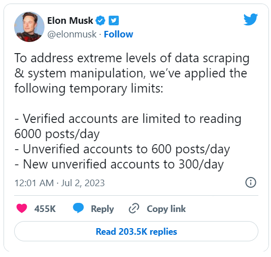

Nonetheless, let’s do some exploration!

For some reasons, we could not upload the raw tweets data, so here is a glimpse of the data:

```python
import pandas as pd

dt_twitter = pd.read_csv("scraped_twitter.csv")
dt_twitter.sample(5)
```

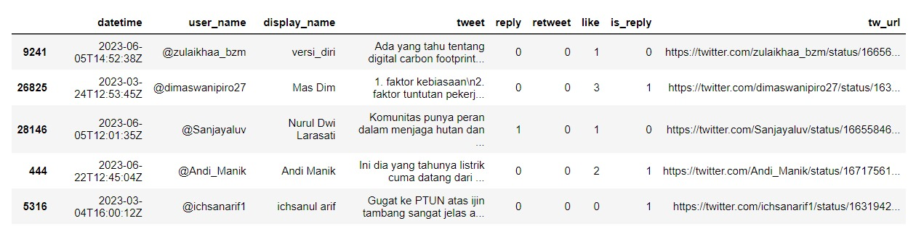

### Twitter data preprocessing

Before moving even further, we need to do some preprocessing stuff to tidy up the data. This data “tidying” includes:

- Make text lowercase
- Removes hyperlinks
- Removes punctuation
- Removes numbers
- Replaces slang words
- Tokenizes

Importing Indonesian slang words from Colloquial Indonesian Lexicon dataset [4] and Indonesian stop words [5].

```python
# slang words
colloquial_indonesia = pd.read_csv("https://raw.githubusercontent.com/nasalsabila/kamus-alay/master/colloquial-indonesian-lexicon.csv")
colloquial_indonesia_dis = colloquial_indonesia[['slang', 'formal']].drop_duplicates().reset_index(drop=True)

# stop words
stopwords_indonesia = pd.read_csv("indonesian-stopwords.txt", header=None, names=['word'])
```

Creating custom functions that perform those tasks above.

```python
import nltk
import re
import string

def clean_text(text):
    text = text.lower()
    text = re.sub('\[.*?\]', '', text)
    text = re.sub('https?://\S+|www\.\S+', '', text)
    text = re.sub('<.*?>+', '', text)
    text = re.sub('[%s]' % re.escape(string.punctuation), '', text)
    text = re.sub('\n', '', text)
    text = re.sub('\w*\d\w*', '', text)
    return text

def text_preprocessing(text):
    tokenizer = nltk.tokenize.RegexpTokenizer(r'\w+')
    nopunc = clean_text(text)
    tokens = pd.DataFrame(tokenizer.tokenize(nopunc), columns=['token'])
    tokens_merged = tokens.merge(colloquial_indonesia_dis, left_on='token', right_on='slang', how='left')
    tokens_merged['formal'] = np.where(tokens_merged['formal'].isna(), tokens_merged['token'], tokens_merged['formal'])
    combined_text = ' '.join(tokens_merged['formal'])
    return combined_text
```

Text preprocessing before and after example:

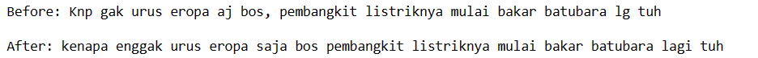

Applying it to the raw data.

```python
filtered_df['tweet_clean'] = filtered_df['tweet'].apply(text_preprocessing)
filtered_df.sample(5)
```

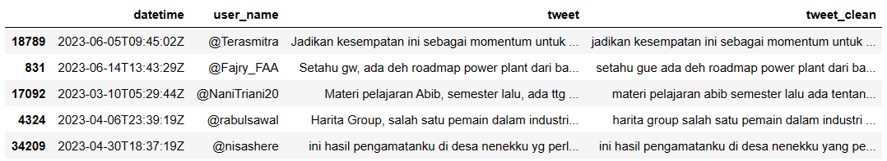

### N-grams analysis

Another approach to visualizing relationships between words in text dataset is using N-grams analysis [6]. N-grams are used to specify the number of words used as observation points, such as unigram (singly-worded phrase), bigram (two-worded phrase), and trigram (three-worded phrase). 

](asset/ngrams-illust.png)

Source: [https://stackoverflow.com/questions/18193253/what-exactly-is-an-n-gram](https://stackoverflow.com/questions/18193253/what-exactly-is-an-n-gram)

#### Top unigrams

```python
from sklearn.feature_extraction.text import CountVectorizer

def get_top_n_words(corpus, n=None):
    vec = CountVectorizer(stop_words = 'english').fit(corpus)
    bag_of_words = vec.transform(corpus)
    sum_words = bag_of_words.sum(axis=0) 
    words_freq = [(word, sum_words[0, idx]) for word, idx in vec.vocabulary_.items()]
    words_freq =sorted(words_freq, key = lambda x: x[1], reverse=True)
    return words_freq[:n]

import matplotlib.pyplot as plt

top_unigrams = get_top_n_words(filtered_df['tweet_clean'], 20)
df_uni = pd.DataFrame(top_unigrams, columns = ['Text' , 'count'])
grouped_df = df_uni.groupby('Text').sum()['count'].sort_values(ascending=True)
plt.barh(grouped_df.index, grouped_df.values, color='steelblue', alpha=0.8)
plt.xlabel('Count')
plt.ylabel('Word')
plt.title('Top 20 Unigrams')
plt.show()
```

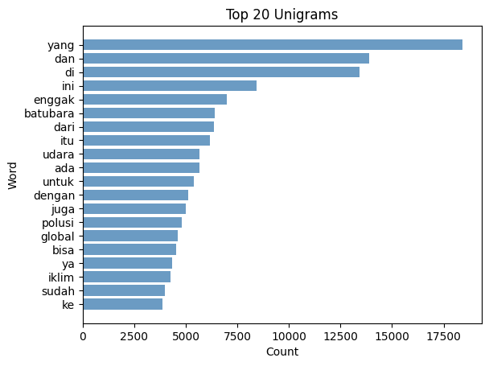

As one might expect, a lot of the most common unigrams are uninteresting words such as `yang` and `di`. These words are usually called stop-words, they might not be useful individually, but is essential for building phrases and sentences.

#### Top bigrams

```python
from sklearn.feature_extraction.text import CountVectorizer

def get_top_n_gram(corpus,ngram_range,n=None):
    vec = CountVectorizer(ngram_range=ngram_range,stop_words = 'english').fit(corpus)
    bag_of_words = vec.transform(corpus)
    sum_words = bag_of_words.sum(axis=0) 
    words_freq = [(word, sum_words[0, idx]) for word, idx in vec.vocabulary_.items()]
    words_freq = sorted(words_freq, key = lambda x: x[1], reverse=True)
    return words_freq[:n]

import matplotlib.pyplot as plt

top_bigrams = get_top_n_gram(filtered_df['tweet_clean'],(2,2),20)
df_bi = pd.DataFrame(top_bigrams, columns = ['Text' , 'count'])
grouped_df = df_bi.groupby('Text').sum()['count'].sort_values(ascending=True)
plt.barh(grouped_df.index, grouped_df.values, color='#ff6961', alpha=0.8)
plt.xlabel('Count')
plt.ylabel('Text')
plt.title('Top 20 Bigrams')
plt.show()
```

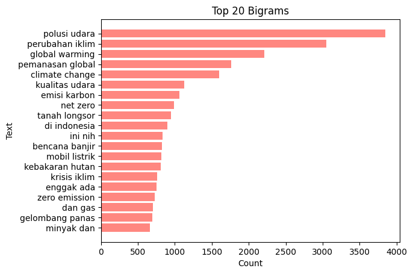

Using this approach, meaningful phrases are obtained. The phrase **polusi udara** , **perubahan iklim**, and **global warming** are the most frequent terms appear in tweets.

### Text length and word count analysis

Using the top bigrams: **polusi udara, perubahan iklim/climate change**, and **pemanasan global/global warming**; let’s zoom into its text length and word count.

```python
# merging necessary data
filtered_df['tweet_len'] = filtered_df['tweet_clean'].astype(str).apply(len)
filtered_df['tweet_word_count'] = filtered_df['tweet_clean'].apply(lambda x: len(str(x).split()))
tweet_polusiudara = filtered_df[filtered_df['tweet_clean'].str.contains('polusi udara',case=False)][[
    'tweet_clean', 'tweet_len', 'tweet_word_count']]
tweet_polusiudara['keyword'] = 'polusi udara'
tweet_perubahaniklim = filtered_df[(filtered_df['tweet_clean'].str.contains('perubahan iklim',case=False))|(
    filtered_df['tweet_clean'].str.contains('climate change',case=False))][[
    'tweet_clean', 'tweet_len', 'tweet_word_count']]
tweet_perubahaniklim['keyword'] = 'perubahan iklim'
tweet_pemanasanglobal = filtered_df[(filtered_df['tweet_clean'].str.contains('pemanasan global',case=False))|(
    filtered_df['tweet_clean'].str.contains('global warming',case=False))][[
    'tweet_clean', 'tweet_len', 'tweet_word_count']]
tweet_pemanasanglobal['keyword'] = 'pemanasan global'
tweet_tlwca = tweet_polusiudara.append(tweet_perubahaniklim).append(tweet_pemanasanglobal, ignore_index=True)
```

#### Tweet length

```python
import matplotlib.pyplot as plt

fig, axes = plt.subplots(nrows=1, ncols=3, figsize=(12, 4))
colors = ['skyblue', 'lightgreen', 'lightcoral']
keywords = ['polusi udara', 'perubahan iklim', 'pemanasan global']

for i, keyword in enumerate(keywords):
    data = tweet_tlwca[tweet_tlwca['keyword'] == keyword]['tweet_len']
    axes[i].hist(data, bins=20, color=colors[i])
    axes[i].set_title(keyword)

plt.suptitle('Tweet length distribution', fontsize=16, fontweight='bold')
plt.tight_layout()
plt.show()
```

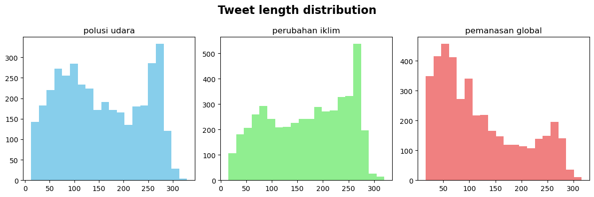

```python
import numpy as np
import matplotlib.pyplot as plt

colors = ['skyblue', 'lightgreen', 'lightcoral']
keywords = ['polusi udara', 'perubahan iklim', 'pemanasan global']
fig, ax = plt.subplots(figsize=(8, 7))
artists = []

for i, keyword in enumerate(keywords):
    data = tweet_tlwca[tweet_tlwca['keyword'] == keyword]['tweet_len']
    artist = ax.boxplot(data, positions=[i+1], widths=0.6, patch_artist=True)
    artists.append(artist['boxes'][0])

ax.set_xticks(range(1, len(keywords) + 1))
ax.set_xticklabels(keywords)
ax.set_xlim(0.5, len(keywords) + 0.5)
ax.set_ylabel('Tweet Length')

for artist, color in zip(artists, colors):
    artist.set(facecolor=color)

global_mean = np.mean(tweet_tlwca['tweet_len'])
ax.axhline(global_mean, linestyle='dashed', color='black')
mean_label = f'Mean: {global_mean:.2f}'
ax.text(len(keywords) + 0.6, global_mean, mean_label, ha='center', va='center',
        bbox=dict(facecolor='white', edgecolor='black', boxstyle='round'),
        color='black')

fig.suptitle('Boxplots of tweet length', fontsize=16, fontweight='bold')
plt.show()
```

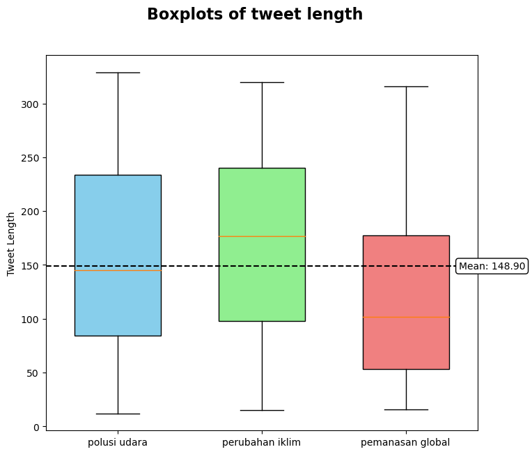

#### Tweet word count

```python
import matplotlib.pyplot as plt

fig, axes = plt.subplots(nrows=1, ncols=3, figsize=(12, 4))
colors = ['skyblue', 'lightgreen', 'lightcoral']
keywords = ['polusi udara', 'perubahan iklim', 'pemanasan global']

for i, keyword in enumerate(keywords):
    data = tweet_tlwca[tweet_tlwca['keyword'] == keyword]['tweet_word_count']
    axes[i].hist(data, bins=20, color=colors[i])
    axes[i].set_title(keyword)

fig.suptitle('Tweet word count distribution', fontsize=16, fontweight='bold')
fig.tight_layout()
plt.show()
```

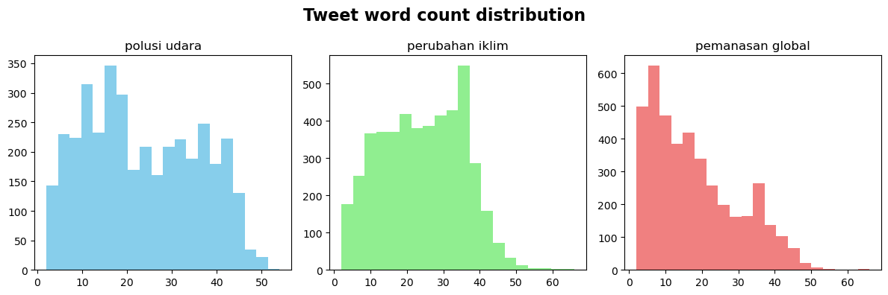

```python
import numpy as np
import matplotlib.pyplot as plt

colors = ['skyblue', 'lightgreen', 'lightcoral']
keywords = ['polusi udara', 'perubahan iklim', 'pemanasan global']
fig, ax = plt.subplots(figsize=(8, 7))
artists = []

for i, keyword in enumerate(keywords):
    data = tweet_tlwca[tweet_tlwca['keyword'] == keyword]['tweet_word_count']
    artist = ax.boxplot(data, positions=[i+1], widths=0.6, patch_artist=True)
    artists.append(artist['boxes'][0])

ax.set_xticks(range(1, len(keywords) + 1))
ax.set_xticklabels(keywords)
ax.set_xlim(0.5, len(keywords) + 0.5)
ax.set_ylabel('Tweet Word Count')

for artist, color in zip(artists, colors):
    artist.set(facecolor=color)

global_mean = np.mean(tweet_tlwca['tweet_word_count'])
ax.axhline(global_mean, linestyle='dashed', color='black')
mean_label = f'Mean: {global_mean:.2f}'
ax.text(len(keywords) + 0.6, global_mean, mean_label, ha='center', va='center',
        bbox=dict(facecolor='white', edgecolor='black', boxstyle='round'),
        color='black')

fig.suptitle('Boxplots of tweet word count', fontsize=16, fontweight='bold')
plt.show()
```

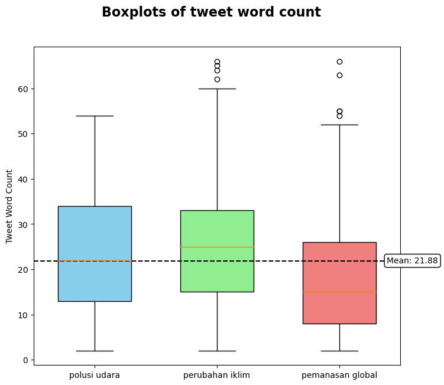

Tweets that are associated with **pemanasan global** are shorter than the other categories, while both **polusi udara** and **perubahan iklim** tweets show a similar pattern in terms of sentence length.

### Word cloud

Word cloud is a popular visual representation of text data where the size of each word corresponds to its frequency. Despite its simplicity, it allows us to obtain quick insights and identify important ideas and patterns in the text.

```python
from wordcloud import WordCloud
import matplotlib.pyplot as plt

text = ' '.join(filtered_df['tweet_clean'].astype(str).tolist())
wordcloud = WordCloud(width=1200, height=800, 
                      background_color='white', 
                      stopwords=stopwords_indonesia['word'],
                      font_path=r'segoeuib.ttf').generate(text)
plt.imshow(wordcloud, interpolation='bilinear')
plt.axis('off')
plt.show()
```

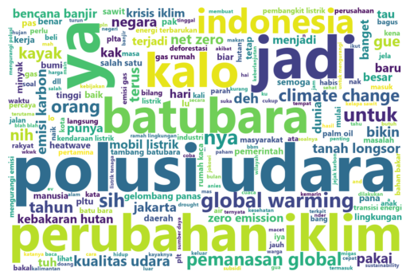

***So.. What’s the insight about our Twitter Netizen so far?***

- Our ideal target to measure whether the awareness is enough or not is using the above standard, 3.5% from the population. **The tweets about climate issues were tweeted by only ~0.1% of the Twitter users in Indonesia.** But of course, not all of Indonesians using Twitter, so the percentage might fall even below than this calculation if we compare it to the real population.
- Among the **top of mind (TOM)** about the climate issues: **polusi udara, perubahan iklim, batubara.** You might also spot some ***************English version*************** terms such as **climate change**, **global warming**, and **zero emission** with smaller proportion. This pattern might at least give us insight to which issues concerned our netizen the most and finally decided to speak it up through tweets. *How do you think? :D Feel free to decide your own interpretation*

## News media content analysis

News reports are undeniably one of the best media to spread information due to their vital role in providing accurate, timely, and comprehensive coverage of events. On the other hand, news media also can plays a significant role in shaping public opinion and influencing societal perceptions of various issues.

***So, how are climate topics being covered in news portals, particularly in Indonesia?***

To answer this, I visited two popular news portal in Indonesia, CNN Indonesia and Katadata, to find news articles which talks about climate topics. 

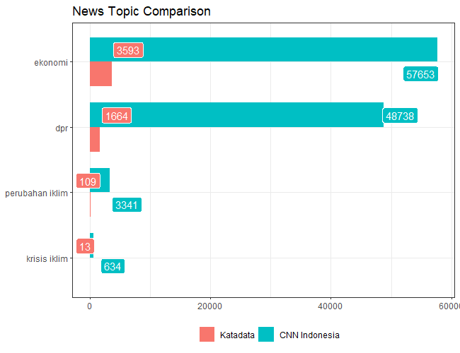

The results… *(sighs)* those numbers show how unpopular this topic is when compared to another popular topic such as **ekonomi** and **dpr**, two words that you might found in your everydays newspaper.

There might be various reasons which led to this result, but how if that one of the reasons is due to the low awareness of the climate issues? Anyway, let’s go a bit deeper to the data!

### Word and document analysis: TF-IDF

The TF-IDF statistic is designed to assess the importance of a word in a collection (or corpus) of documents, such as one novel in a collection of novels or one website in a collection of websites [6]. Term frequency (TF) is the frequency with which a word appears in a document, whereas inverse document frequency (IDF) reduces the weight of frequently used words while increasing the weight of words that are rarely used in a collection of documents. The TF-IDF statistic is defined by multiplying those two numbers.

**Top 10 terms of some Katadata news articles**

```r
library(data.table)
library(tidyverse)
library(tidytext)

dt_katadata <- fread("scraped_katadata.csv")

katadata_word_freq <- dt_katadata %>% 
  unnest_tokens(word, content) %>% 
  count(title, word)
katadata_tf_idf <- katadata_word_freq %>% 
  bind_tf_idf(word, title, n)

katadata_tf_idf %>% 
  slice_max(order_by = tf_idf, n = 10) %>% 
  print()
```

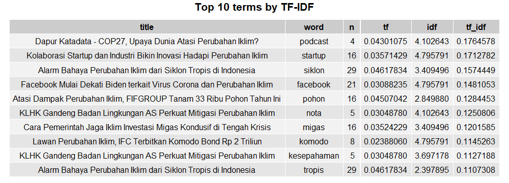

### Sentiment analysis

Applying the Pareto principle, it is feasible to discover that the 80% of the news article content can be understood by 20% of their most important keywords only. As a result, these keywords have the potential to adequately capture and convey the articles' overall sentiment and essence.

```python
import pandas as pd
from transformers import AutoTokenizer, AutoModel, pipeline, AutoModelForSequenceClassification

pretrained= "mdhugol/indonesia-bert-sentiment-classification"
model = AutoModelForSequenceClassification.from_pretrained(pretrained)
tokenizer = AutoTokenizer.from_pretrained(pretrained)
sentiment_analysis = pipeline("sentiment-analysis", model=model, tokenizer=tokenizer)
sentiment_table = pd.DataFrame({
    'sentiment_label':['LABEL_0', 'LABEL_1', 'LABEL_2'],
    'sentiment':['POSITIVE', 'NEUTRAL', 'NEGATIVE']
})

katadata = pd.read_csv("katadata_tf_idf_top20.csv")
katadata['sentiment_label'] = katadata['word'].apply(get_sentiment)
katadata_sentiment = katadata.merge(sentiment_table, on='sentiment_label')
print(katadata_sentiment)
```

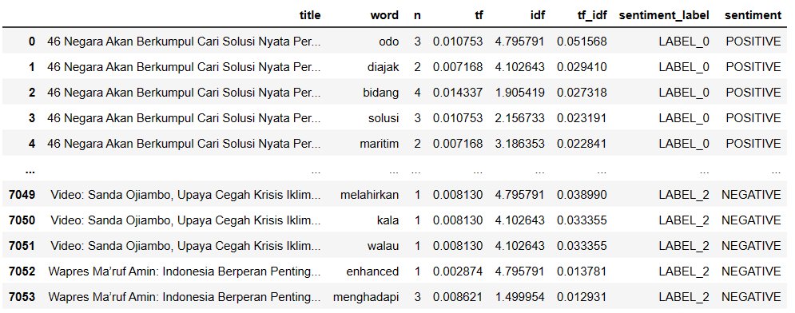

We conducted sentiment classification using the top 20% terms in each news article with IndoBERT [7], a pre-trained language model based on BERT architecture for the Indonesian language. There are more fancy approaches to do feature selection in text classification, while my approach is just a simple one.

```python
katadata_sentiment_final = katadata_sentiment.groupby(['title', 'sentiment']).size().to_frame('count').reset_index()
katadata_sentiment_final = katadata_sentiment_final.groupby('title').apply(
    lambda x: x.nlargest(1, 'count')).reset_index(drop=True)
katadata_sentiment_final_size = katadata_sentiment_final['sentiment'].value_counts().reset_index()
katadata_sentiment_final_size.rename(columns={'sentiment':'count', 'index':'sentiment'}, inplace=True)

import matplotlib.pyplot as plt

plt.figure(figsize=(8,6))
colors = ['steelblue', 'lightgrey', 'salmon']
total_count = katadata_sentiment_final_size['count'].sum()
plt.bar(katadata_sentiment_final_size['sentiment'], katadata_sentiment_final_size['count'], color=colors)
for i, count in enumerate(katadata_sentiment_final_size['count']):
    label = f"{count} ({count/total_count*100:.1f}%)"
    plt.text(i, count, label, ha='center', va='bottom')
plt.xlabel('Sentiment')
plt.ylabel('Count')
plt.title('Sentiment Distribution')
plt.show()
```

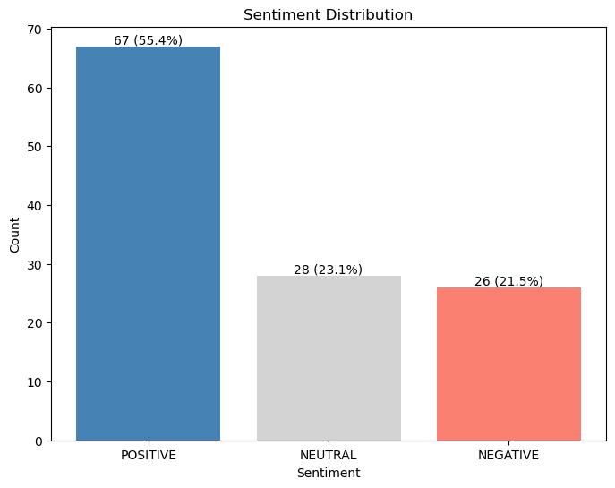

The analysis revealed a notable trend, with more news articles displaying positive sentiment than negative sentiment. This finding suggests that optimistic or favorable news is prevalent in Katadata media, indicating a potential bias toward positive content in the news media landscape for this particular topic.

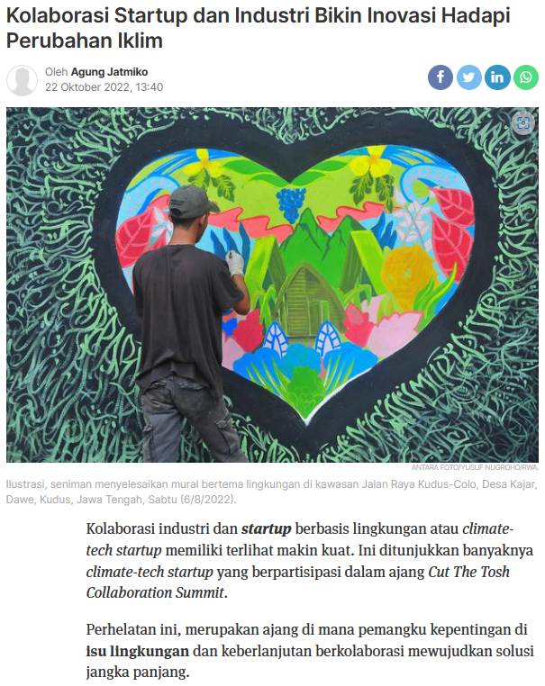

Example of positive-sentiment analyzed news

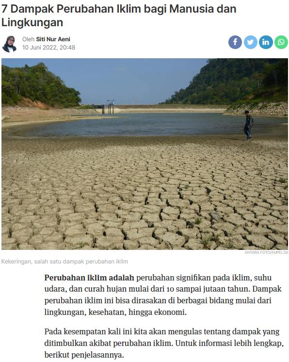

Example of negative-sentiment analyzed news

## Busting the myth: rising temperatures vs increasing climate-related topics queries

The undeniable fact that global temperatures are rising has fueled fears about climate change and its consequences. There is a hypothesis which stated that general public's interest in climate issues has grown as a result of this phenomenon. To gather evidence, we compared the average temperature in Indonesia over the last decade to Google Trends' popularity of climate-related topics. By examining the correlation between these two factors, we can assess whether rising temperatures and the public's engagement with climate issues are somehow related.

### Trend comparison

```r
library(data.table)
library(tidyverse)

climate_trend_google <- fread("climate-topic-google-trend.csv")
climate_trend_google$month = ym(climate_trend_google$month)
dt_temperature <- fread("climate_data.csv")
dt_temperature$date <- dmy(dt_temperature$date)

temperature_id <- dt_temperature %>% 
  group_by(month = floor_date(date, "months")) %>% 
  summarize(avg_temperature = mean(Tavg, na.rm = TRUE))
search_vs_temperature <- temperature_id %>% 
  left_join(climate_trend_google, by = "month")

plot_label <- c("Average Temperature (in °C)", "Climate Topic Google Trend (%)")
names(plot_label) <- c("avg_temperature", "popularity")
search_vs_temperature %>%
  pivot_longer(-month) %>%
  ggplot(aes(x = month, y = value)) +
  geom_line() +
  geom_smooth(method = "lm", se = FALSE) +
  facet_wrap(~name, scales = "free_y", labeller = labeller(name = plot_label)) +
  theme_bw() +
  labs(title = "Temperature vs Climate Topic Trend") +
  theme(axis.title = element_blank())
```

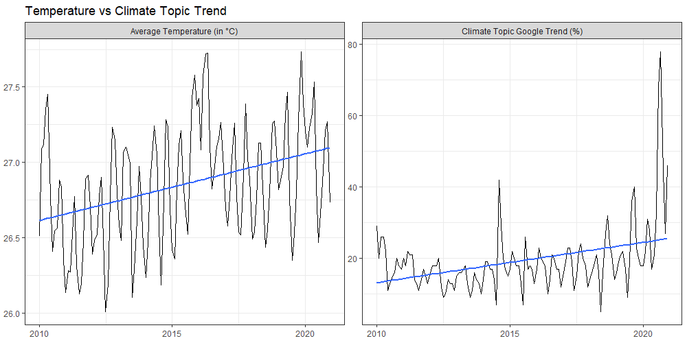

Indonesia temperature data can be found [here](https://www.kaggle.com/datasets/greegtitan/indonesia-climate).

In conclusion, a comparison of the average temperature in Indonesia over the last decade with the popularity of climate topics using Google Trends **shows that the trends are similar.** It is sad ****to know that we have been experiencing the increasing temperature 

### Correlation statistics

```r
cor_val <- search_vs_temperature %>% 
  summarize(
    metrics = "correlation", 
    value = cor(avg_temperature, popularity)
  )
print(cor_val)
```


However, the correlation between these two variables is low, making determining a clear influence between them difficult. While the findings suggest a link, more research and consideration of other factors are needed to establish a stronger link between rising temperatures and public engagement with climate issues.

## Closing Thoughts

Climate change is an inevitable phenomenon that is happening. As pieces of information spread more quickly than ever, people are expected to concern more about the issue that endangered our home planet and even our own existence. Exploring Twitter, it is discovered that Indonesian netizens are pretty aware of climate issues. Although the number can't be ascertained, we believe that the actual number of tweets might be higher (further study is highly encouraged, but it all depends on Melon’s policy :D). ***However, the journey to make 0.1% into 3.5% of only the Twitter population still quite far. It means that we need around 800K+ users aware and, concerned, and tweeted about this issue.***

Moving on to news media, using sentiment analysis, we learned that our news media ***presents more favorable perspectives of news than negative ones** (Yes, you read it right. Climate-issues but packaged into favorable perspective :D).* This might sound nice and spark the optimism, such as certain efforts to counter climate-crisis were already made. But we must also understand that we will not always get the good news. You might remember how media’s narrative had changed during pandemic era. From being skeptical in the beginning to become frightening in the peak-era. As much as there were always people hated intimidating news, it helped the solid and massive awareness for the people to fight over problems.

Finally, while there is an upward trend in average temperatures and the popularity of climate-related queries on Google, there is no statistical evidence to conclude that the two phenomena are connected. At the end of the day, we need more than just awareness to face this issue. Of course, ***becoming aware is the first and crucial step,*** but the ultimate goal is to create ***a collective notion of urgency among individuals to finally take action.***

***So, have you taken your first step?***

---

## References

[1] A. Tyson, B. Kennedy, and C. Funk. "Gen Z, Millennials Stand Out for Climate Change Activism, Social Media Engagement With Issue." Pew Research Center Science & Society. [https://www.pewresearch.org/science/2021/05/26/gen-z-millennials-stand-out-for-climate-change-activism-social-media-engagement-with-issue/](https://www.pewresearch.org/science/2021/05/26/gen-z-millennials-stand-out-for-climate-change-activism-social-media-engagement-with-issue/) (accessed Jun. 29, 2023).

[2] D. Robson. "The '3.5% rule': How a small minority can change the world." BBC. [https://www.bbc.com/future/article/20190513-it-only-takes-35-of-people-to-change-the-world](https://www.bbc.com/future/article/20190513-it-only-takes-35-of-people-to-change-the-world) (accessed Jul. 1, 2023).

[3] DataReportal. "Digital 2023: Indonesia — DataReportal – Global Digital Insights." DataReportal – Global Digital Insights. [https://datareportal.com/reports/digital-2023-indonesia](https://datareportal.com/reports/digital-2023-indonesia) (accessed Jun. 28, 2023).

[4] N. Aliyah Salsabila, Y. Ardhito Winatmoko, A. Akbar Septiandri, and A. Jamal, "Colloquial Indonesian Lexicon," in *2018 Int. Conf. Asian Lang. Process. (IALP)*, Bandung, Indonesia, Nov. 15–17, 2018. IEEE, 2018. Accessed: Jul. 1, 2023. [Online]. Available: [https://doi.org/10.1109/ialp.2018.8629151](https://doi.org/10.1109/ialp.2018.8629151)

[5] Dedhia, H., “Stop words in 28 languages”, Version 1, 2020, Retrieved July 1, 2023 from [https://www.kaggle.com/datasets/heeraldedhia/stop-words-in-28-languages](https://www.kaggle.com/datasets/heeraldedhia/stop-words-in-28-languages).

[6] D. Robinson and J. Silge. "Tidy Text Mining with R." [https://www.tidytextmining.com/](https://www.tidytextmining.com/) (accessed Jul. 1, 2023).

[7] F. Koto, A. Rahimi, J. H. Lau, and T. Baldwin, “IndoLEM and IndoBERT: A Benchmark Dataset and Pre-trained Language Model for Indonesian NLP,” 2020.

[8] Pandey, P., “EDA and Preprocessing for BERT”, Version 24, 2020, Accessed July 1, 2023 on [https://www.kaggle.com/code/parulpandey/eda-and-preprocessing-for-bert](https://www.kaggle.com/code/parulpandey/eda-and-preprocessing-for-bert).

[9] Titan, G. and Adriel E., “Climate Data Daily IDN”, Version 5, 2022, Retrieved June 30, 2023 on [https://www.kaggle.com/datasets/greegtitan/indonesia-climate](https://www.kaggle.com/datasets/greegtitan/indonesia-climate).
